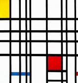

# `rpiet`, the piet interpreter in Rust 🖼

[`piet`](http://www.dangermouse.net/esoteric/piet.html) is a esoteric programming language which executes image files.
This is a piet interpreter written in Rust.

> Composition with Red, Yellow and Blue. 1921, Piet Mondrian.

Piet is a programming language which aims to treat images similar to those of the artist **Piet Mondrian** as executables.
Read more about how images are executed [at the Piet homepage](http://www.dangermouse.net/esoteric/piet.html).

## State of this crate

This is my current "I learn some Rust" project.
I will expand it every time I have some minutes to work on it, but don't expect it to be complete anytime soon.
This project is likely to become my bikeshedding target to learn some Rust concepts and won't be able to execute actual piet images soon.

However, feel free to watch this space and give me feedback on the code if you feel like it. 🌻

## Contributing

Bug reports and pull requests are welcome on GitHub at https://github.com/tessi/rpiet. This project is intended to be a safe, welcoming space for collaboration, and contributors are expected to adhere to the [Contributor Covenant](http://contributor-covenant.org) code of conduct.

## License

The crate is available as open source under the terms of the [MIT License](https://opensource.org/licenses/MIT).

## Code of Conduct

Everyone interacting in the rpiet project’s codebases, issue trackers, chat rooms and mailing lists is expected to follow the [code of conduct](https://github.com/tessi/rpiet/blob/master/CODE_OF_CONDUCT.md).